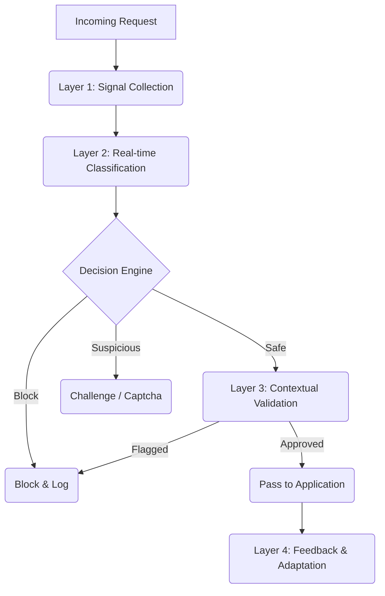

# SKILL.md: Fraud Detection Sentinel

**Skill Name:** `fraud-detection-sentinel`
**Description:** A sophisticated fraud detection system designed for price comparison platforms to prevent affiliate abuse, bot scraping, and click fraud.
**Maintainer:** Security Team
**Version:** 1.0.0

---

## 1. The Threat Model: Price Comparison Specifics

Price comparison engines (PCEs) are high-value targets for specific types of abuse. Unlike standard e-commerce, the threats here are unique:

| Threat Type | Mechanism | Impact |
|-------------|-----------|--------|
| **Affiliate Stuffing** | Bots clicking outgoing links to generate fake affiliate cookies | Revenue reversal, banned from affiliate networks |
| **Price Scraping** | Competitors scraping your aggregated data to undercut or clone | Server load, loss of competitive advantage |
| **Merchant Manipulation** | Merchants artificially lowering/raising prices to game rankings | Loss of user trust, platform reputation damage |
| **Review Bombing** | Fake reviews to boost/derank specific merchants | Misleading signals, user churn |
| **Referral Cycle** | Bots cycling through referral links (Sybil attack) | Draining marketing budget |

---

## 2. Integrated Defense Architecture

This skill implements a **4-Layer Defense-in-Depth** strategy:



### Layer 1: Signal Collection (Client & Server)

Collect high-fidelity signals without adding friction to legitimate users.

**Client-Side Fingerprinting (Lightweight):**
```typescript
// signals.ts
import FingerprintJS from '@fingerprintjs/fingerprintjs';

export async function collectDeviceSignals() {
  const fp = await FingerprintJS.load();
  const result = await fp.get();
  
  return {
    visitorId: result.visitorId,
    screenRes: `${window.screen.width}x${window.screen.height}`,
    timezone: Intl.DateTimeFormat().resolvedOptions().timeZone,
    isTouch: 'ontouchstart' in window,
    battery: (navigator as any).getBattery ? await (navigator as any).getBattery().then((b: any) => b.level) : null,
    // Detect automation
    webdriver: navigator.webdriver,
    headless: /HeadlessChrome/.test(navigator.userAgent)
  };
}
```

**Server-Side Analysis:**
- **TLS Fingerprinting (JA3):** Identify client SSL/TLS handshake patterns (critical for detecting non-browser scripts like Python/Requests).
- **IP Velocity:** Requests per minute from subnet (not just IP).
- **Referer Analysis:** Check for empty or spoofed referrers on deep links.

### Layer 2: Real-time Classification (ML Model)

An ensemble model deployed on Edge (e.g., Cloudflare Workers or Supabase Edge Functions) for <50ms decisioning.

**Scoring Factors:**
1.  **Bot Probability (0-1):** Based on behavioral biometrics (mouse curves, touch pressure).
2.  **Reputation Score (0-100):** IP/User history.
3.  **Anomaly Score (0-1):** Deviation from standard user flow (e.g., direct API access vs. UI navigation).

**Decision Logic:**
- `Score < 20`: **Green** (Pass)
- `Score 20-75`: **Yellow** (Invisible Challenge / PoW)
- `Score > 75`: **Red** (Block / Fake Data)

### Layer 3: Contextual Validation (Business Logic)

Rules specific to the Georgian market and PCE context.

**Ruleset:**
1.  **The "Impossible Traveler":** Login from Tbilisi then Batumi within 5 minutes.
2.  **The "Click Farm":** >50 outgoing affiliate clicks in <1 minute with 0 scroll depth.
3.  **Merchant Price Volatility:** Price change >80% in 1 hour (flag for manual review, prevent listing).
4.  **Category Hopping:** User comparing "Baby Diapers" and "Industrial Lathes" rapidly (typical scraper behavior).

### Layer 4: Feedback & Adaptation

The loop is closed by feeding outcomes back into the system.
- **Affiliate Network Postbacks:** Did the click convert? (Validates traffic quality).
- **User Reports:** "Price was wrong" (Detects merchant manipulation).
- **Manual Review:** Analyst decisions retrain the ML model.

---

## 3. Implementation Patterns

### 3.1 Next.js Middleware (The Gatekeeper)

Protect your routes at the edge.

```typescript
// middleware.ts
import { NextResponse } from 'next/server';
import type { NextRequest } from 'next/server';
import { analyzeRequest } from '@/lib/sentinel';

export async function middleware(req: NextRequest) {
  // 1. Skip static assets
  if (req.nextUrl.pathname.startsWith('/_next')) return NextResponse.next();

  // 2. Collect Server Signals
  const ip = req.ip || '127.0.0.1';
  const ua = req.headers.get('user-agent') || '';
  const country = req.geo?.country || 'GE';

  // 3. Analyze (Layer 1 & 2)
  const risk = await analyzeRequest({ ip, ua, country, path: req.nextUrl.pathname });

  // 4. Act
  if (risk.action === 'BLOCK') {
    // Return a 403 or a "Honey Page" (fake content to confuse scrapers)
    return new NextResponse(JSON.stringify({ error: 'Access Denied' }), { status: 403 });
  }

  if (risk.action === 'CHALLENGE') {
    // Redirect to intermission page with CAPTCHA
    const url = req.nextUrl.clone();
    url.pathname = '/security-check';
    return NextResponse.rewrite(url);
  }

  // 5. Log & Pass (Async logging to avoid latency)
  if (risk.score > 0) {
    console.log(`[SENTINEL] Request allowed with risk score: ${risk.score}`);
  }

  return NextResponse.next();
}
```

### 3.2 Secure Click Tracking (Affiliate Protection)

Never expose raw affiliate links. Use a signed redirection system.

```typescript
// app/api/go/route.ts
import { verifySignature } from '@/lib/crypto';
import { db } from '@/lib/db';

export async function GET(req: NextRequest) {
  const { searchParams } = new URL(req.url);
  const offerId = searchParams.get('id');
  const sig = searchParams.get('sig'); // HMAC signature
  const timestamp = Number(searchParams.get('ts'));

  // 1. Validate Signature (Prevent link tampering)
  if (!verifySignature(offerId, timestamp, sig)) {
    return NextResponse.json({ error: 'Invalid Link' }, { status: 400 });
  }

  // 2. Validate Timestamp (Prevent replay attacks / scraped links validity)
  if (Date.now() - timestamp > 3600000) { // 1 hour expiry
    return NextResponse.json({ error: 'Link Expired' }, { status: 410 });
  }

  // 3. Fraud Check (Layer 3)
  const isFraud = await runFraudChecks(req, offerId);
  
  if (isFraud) {
    // "Ghosting": Redirect to homepage instead of blocking, confusion tactic
    return NextResponse.redirect(new URL('/', req.url));
  }

  // 4. Log Click
  await db.clicks.create({ offerId, ip: req.ip, ua: req.headers.get('user-agent') });

  // 5. Redirect to Merchant
  const offer = await db.offers.find(offerId);
  return NextResponse.redirect(offer.affiliateUrl);
}
```

### 3.3 Database Schema for Signals

```sql
-- PostgreSQL / Supabase Schema

CREATE TABLE sentinel_events (
    id UUID PRIMARY KEY DEFAULT gen_random_uuid(),
    created_at TIMESTAMPTZ DEFAULT NOW(),
    
    -- Identity
    ip_address INET,
    visitor_id TEXT, -- Device Fingerprint
    user_id UUID REFERENCES auth.users(id),
    
    -- Context
    event_type TEXT NOT NULL, -- 'login', 'click_out', 'search', 'register'
    resource_id TEXT, -- e.g., product_id being clicked
    
    -- Signals
    risk_score FLOAT CHECK (risk_score >= 0 AND risk_score <= 100),
    signals JSONB, -- { "vpn": true, "headless": false, "velocity": 12 }
    
    -- Decision
    action_taken TEXT, -- 'ALLOW', 'BLOCK', 'CHALLENGE'
    
    -- Metadata
    user_agent TEXT,
    referer TEXT,
    geo_country TEXT,
    geo_city TEXT
);

CREATE INDEX idx_sentinel_ip ON sentinel_events(ip_address);
CREATE INDEX idx_sentinel_visitor ON sentinel_events(visitor_id);
```

---

## 4. Operational Best Practices

### 4.1 "Honey Pots" for Scrapers
Insert invisible elements into your DOM that legitimate users can't see or click.
- **Trap Links:** `<a href="/trap-endpoint" style="display:none">Admin</a>`. If clicked -> Permanent IP Ban.
- **Ghost Data:** Add invisible product listings with absurd prices. If a competitor lists this product/price, you have proof they scraped you.

### 4.2 Rate Limiting Strategy
Don't just limit by IP (easy to rotate). Limit by:
- **Fingerprint:** Use `visitor_id` from FingerprintJS.
- **Behavior:** Limit "Price Checks" per minute, not just "Requests".
- **Token Bucket:** Allow bursts (browsing) but throttle sustained high velocity (scraping).

### 4.3 Handling False Positives
**Never block silently** unless you are 100% sure.
- Always offer a path to redemption (e.g., "Verify you are human").
- Log "Soft Blocks" to monitor rule aggressiveness before enabling "Hard Blocks".
- Provide a clear support code for blocked users to reference if they contact support.

---

## 5. Integration Roadmap

1.  **Phase 1: Silent Mode.** specific "Observer" middleware. Log scores, build baselines. DO NOT BLOCK.
2.  **Phase 2: Obvious Bot Blocking.** Enable rules for `Headless Chrome`, `Curl`, `Python-Requests`.
3.  **Phase 3: Rate Limiting.** Enable velocity checks on API endpoints.
4.  **Phase 4: ML Activation.** Enable behavioral scoring.
5.  **Phase 5: Affiliate Protection.** Enforce signed links and expiring timestamps.

---

This skill turns your platform from a soft target into a hardened fortress, protecting not just your data, but your revenue stream and merchant relationships.
