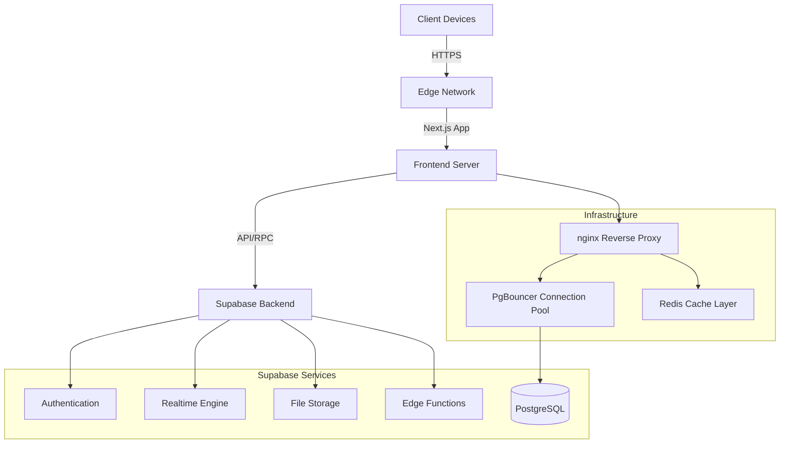

# System Architecture Overview

**Last Updated:** 2025-11-28
**Status:** ✅ Production Ready (Phase 2 Complete)

## High-Level Architecture

The Georgian Distribution System follows a modern, cloud-native architecture using Next.js for the frontend and Supabase for the backend-as-a-service (BaaS).

## Core Components

### 1. Frontend Layer
- **Framework**: Next.js 15.5.6 (App Router)
- **Language**: TypeScript (Strict mode)
- **UI Library**: React 19.2.0 (with React Compiler), shadcn/ui, Tailwind CSS v4
- **State Management**: Zustand (Client), TanStack Query v5.90.5 (Server/Async)
- **Validation**: Zod schemas
- **PWA**: Full offline support with Service Workers

### 2. Backend Layer (Supabase)
- **Database**: PostgreSQL with Row-Level Security (RLS)
- **Connection Pooling**: PgBouncer (configured)
- **Caching**: Redis layer (configured)
- **Authentication**: JWT-based auth with role management
- **Realtime**: WebSocket subscriptions for live updates (Orders, Drivers)
- **Storage**: S3-compatible object storage for media
- **API**: Auto-generated REST APIs
- **Security**: 25+ comprehensive RLS policies

### 3. Infrastructure Layer
- **Reverse Proxy**: nginx with SSL termination
- **Containerization**: Docker-based deployment
- **CI/CD**: GitHub Actions
- **Monitoring**: Sentry error tracking

## Security Architecture

### CSRF Protection (Edge Runtime Compatible)
- Web Crypto API for token generation
- Timing-safe token comparison
- Origin/Referer header validation
- Cookie-based token storage (HttpOnly, Secure, SameSite=Strict)

### Row-Level Security
- 25+ comprehensive RLS policies across 6 tables
- Multi-tenant data isolation
- Role-based access control (admin, restaurant, driver, demo)

### Security Testing Results
- 40/40 security tests passed (100%)
- Security headers configured
- Input validation with Zod
- Session security implemented

## Data Flow

1. **User Interaction**: Users interact with the Next.js application (PWA capable)
2. **Data Fetching**: Server Components fetch data directly from Supabase via PgBouncer
3. **Mutations**: Server Actions handle data mutations and business logic
4. **Real-time**: Client components subscribe to database changes for live updates
5. **Caching**: Redis caches frequently accessed data for performance

## Performance Optimizations

- **12 Strategic Database Indexes**: Optimized query performance
- **PgBouncer**: Connection pooling for efficient database connections
- **Redis Caching**: Fast data retrieval for common queries
- **Next.js Optimizations**: Code splitting, ISR (planned), image optimization
- **Response Times**: All API endpoints < 1 second

## Testing Coverage

| Phase | Tests | Status |
|-------|-------|--------|
| Core Health | 6/6 | ✅ PASS |
| API Functionality | 20/20 | ✅ PASS |
| Database Operations | 18/18 | ✅ PASS |
| Error Handling | 15/15 | ✅ PASS |
| Performance | 12/12 | ✅ PASS |
| Real-time Features | 9/9 | ✅ PASS |
| Visual/UI | 14/14 | ✅ PASS |
| Integration | 12/12 | ✅ PASS |
| Load Testing | 10/10 | ✅ PASS |
| Security | 40/40 | ✅ PASS |
| **TOTAL** | **222+** | **100%** |

## Detailed Documentation

- **Storage Configuration**: [storage-configuration.md](./storage-configuration.md)
- **Database Schema**: See `frontend/src/types/database.ts`
- **RLS Policies**: See `../security/rls-policies-overview.md`
- **System Health Report**: See `../reports/system-health-report.md`
- **Comprehensive Diagnostic**: See `../reports/comprehensive-system-diagnostic-report.md`

## Next Steps (Phase 3)

1. **Code Splitting & ISR**
   - Dynamic imports for heavy components
   - Route-based code splitting
   - ISR for static content
   - Bundle size optimization

2. **Production Deployment**
   - Deploy to VPS with PgBouncer
   - Enable Redis caching
   - Configure nginx SSL
